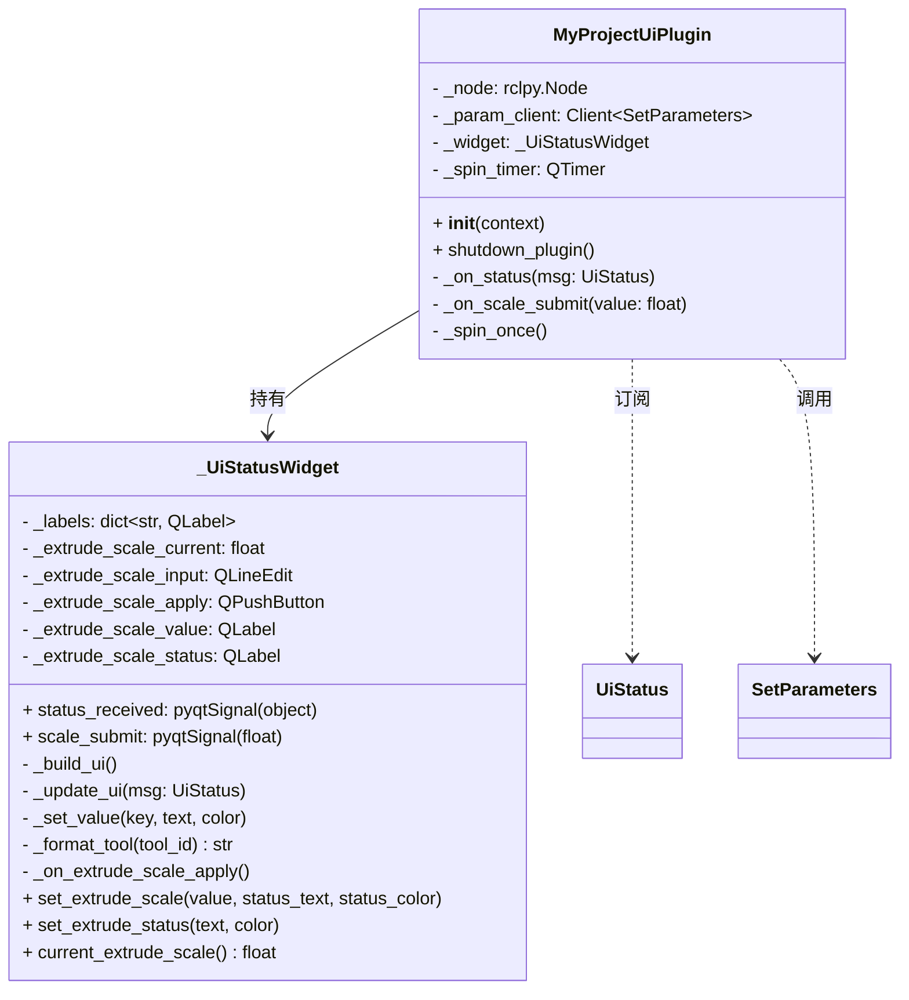
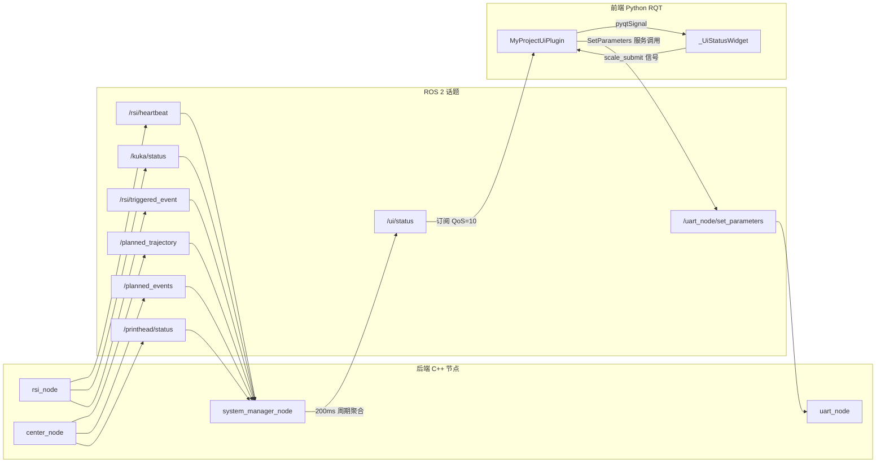
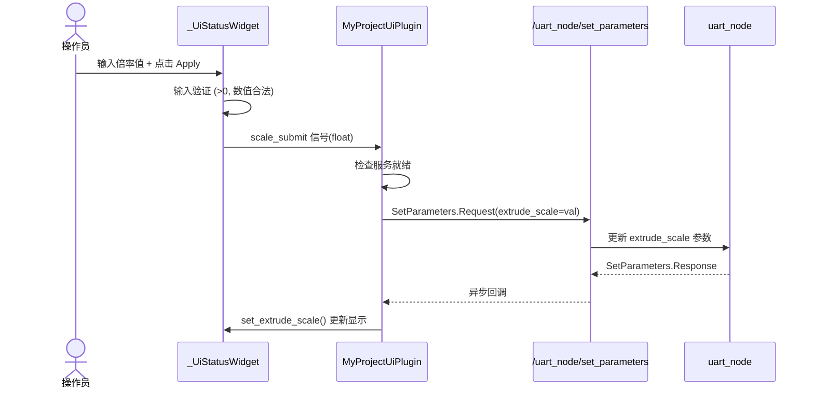

# my_project_ui 架构文档

> **版本**: v1.0  
> **最后更新**: 2026-05-25  
> **用途**: 本文档作为 UI 代码的版本管理指导，每次对 UI 界面进行功能添加或修改时，都应同步更新本文档。

---

## 1. 总览

`my_project_ui` 是 KUKA RAM 系统的操作员监控面板，基于 **ROS 2 RQT 插件框架** 构建，使用 **PyQt5 (python_qt_binding)** 实现 GUI。

### 核心职责

- **实时状态监控**: 订阅 `/ui/status` 话题，展示系统运行状态的完整快照
- **参数在线调节**: 通过 ROS 2 Parameter Service 远程修改 `uart_node` 的 `extrude_scale` 参数
- **状态可视化**: 对各子系统的健康状态进行颜色编码，便于操作员快速判断

### 技术栈

| 项目 | 技术 |
|------|------|
| GUI 框架 | PyQt5 (`python_qt_binding`) |
| 插件框架 | RQT (`rqt_gui_py.Plugin`) |
| ROS 2 通信 | `rclpy` |
| 消息类型 | `my_project_interfaces/msg/UiStatus` |
| 参数服务 | `rcl_interfaces/srv/SetParameters` |
| 构建系统 | `ament_python` |

---

## 2. 文件结构

```text
my_project_ui/
├── my_project_ui/
│   ├── __init__.py              # 包标识文件
│   └── ui_panel.py              # 核心 UI 代码（所有逻辑集中于此文件）
├── resource/
│   └── my_project_ui            # ament 资源索引标记文件
├── test/
│   ├── test_copyright.py        # 版权检查测试
│   ├── test_flake8.py           # flake8 代码风格测试
│   └── test_pep257.py           # pep257 文档字符串测试
├── LICENSE                      # Apache-2.0 许可
├── package.xml                  # ROS 2 包清单（声明依赖）
├── plugin.xml                   # RQT 插件注册描述
├── setup.cfg                    # Python 构建配置
├── setup.py                     # setuptools 安装脚本
└── UI_ARCHITECTURE.md           # 本文档
```

---

## 3. 插件注册与加载机制

### 3.1 RQT 插件注册

UI 通过 RQT 插件机制注册，在 `rqt` 中作为可选面板加载。

**`plugin.xml`** 定义了插件的入口：

```xml
<library path="my_project_ui">
  <class name="my_project_ui/UiPanel"
         type="my_project_ui.ui_panel.MyProjectUiPlugin"
         base_class_type="rqt_gui_py::Plugin">
    <description>my_project UI status panel</description>
    <qtgui>
      <label>MyProject UI</label>
      <statustip>my_project status monitor panel</statustip>
    </qtgui>
  </class>
</library>
```

**`package.xml`** 中的关键导出声明：

```xml
<export>
  <build_type>ament_python</build_type>
  <rqt_gui plugin="${prefix}/plugin.xml"/>
</export>
```

### 3.2 依赖关系

| 依赖包 | 用途 |
|--------|------|
| `rclpy` | ROS 2 Python 客户端，用于节点创建和话题订阅 |
| `std_msgs` | ROS 2 标准消息类型 |
| `rqt_gui_py` | RQT Python 插件基类 |
| `rqt_gui` | RQT GUI 框架 |
| `my_project_interfaces` | 自定义消息定义（`UiStatus` 等） |

### 3.3 启动方式

UI 面板 **不在 launch 文件中启动**，而是通过 `rqt` 命令独立加载：

```bash
rqt --standalone my_project_ui/UiPanel
# 或在 rqt 中通过菜单选择 "MyProject UI" 面板
```

---

## 4. 类架构

`ui_panel.py` 包含两个核心类，采用 **职责分离** 模式：



### 4.1 `MyProjectUiPlugin` — ROS 2 / RQT 桥接层

**文件位置**: [ui_panel.py L532-592](file:///home/jayson/kuka_ram_ws/src/my_project/my_project_ui/my_project_ui/ui_panel.py#L532-L592)

| 职责 | 说明 |
|------|------|
| ROS 2 节点管理 | 创建名为 `my_project_ui_panel` 的 ROS 2 节点 |
| 话题订阅 | 订阅 `/ui/status` (UiStatus)，QoS 深度 10 |
| 参数服务客户端 | 连接 `/uart_node/set_parameters` 服务 |
| Qt 定时器驱动 | 每 50ms 调用一次 `rclpy.spin_once()`，驱动 ROS 2 回调 |
| 信号桥接 | 将 ROS 2 回调线程中的消息通过 `pyqtSignal` 安全地传递到 Qt 主线程 |

**关键机制 — 线程安全信号桥接**:

```python
# ROS 2 回调（可能在非 Qt 线程）
def _on_status(self, msg: UiStatus):
    self._widget.status_received.emit(msg)  # 通过信号安全跨线程

# Qt 主线程中执行 UI 更新
self.status_received.connect(self._update_ui)
```

### 4.2 `_UiStatusWidget` — 纯 UI 表现层

**文件位置**: [ui_panel.py L10-530](file:///home/jayson/kuka_ram_ws/src/my_project/my_project_ui/my_project_ui/ui_panel.py#L10-L530)

| 职责 | 说明 |
|------|------|
| 界面构建 | `_build_ui()` 方法构建全部 UI 元素 |
| 数据展示 | `_update_ui()` 方法解析 `UiStatus` 消息并更新所有字段 |
| 用户交互 | 挤出倍率输入 + Apply 按钮，带输入验证 |
| 颜色编码 | 根据数据有效性/状态动态设置文字颜色 |

---

## 5. 数据流架构

### 5.1 数据流全景



### 5.2 数据源：`system_manager_node`（C++）

**文件位置**: [system_manager_node.cpp](file:///home/jayson/kuka_ram_ws/src/my_project/control_center/src/system_manager_node.cpp)

`system_manager_node` 是 UI 的**唯一数据源**，它将多个话题聚合为一个 `UiStatus` 消息：

| 订阅话题 | 消息类型 | 数据来源 |
|----------|----------|----------|
| `/rsi/heartbeat` | `RsiHeartBeat` | RSI 节点每个控制周期发布的心跳 |
| `/kuka/status` | `KukaStatus` | 机械臂当前 XYZABC 位姿 |
| `/printhead/status` | `PrintHeadStatus` | 打印头温度、风扇、工具状态 |
| `/planned_trajectory` | `TrajectoryPoint` | 规划轨迹点队列 |
| `/planned_events` | `PlannedEvent` | 规划事件队列 |
| `/rsi/triggered_event` | `PlannedEvent` | 已触发的事件 |

**聚合逻辑**:
- 每 **100ms** (`ui_publish_period_ms` 参数) 发布一次 `UiStatus`
- 系统状态基于心跳超时判定：`WAIT_HEARTBEAT` → `RUNNING` → `HEARTBEAT_LOST`
- 轨迹队列基于心跳 `seq_used` 自动对齐清理
- 事件队列基于触发序号自动推进

### 5.3 反向控制：挤出倍率调节



---

## 6. UI 布局结构

### 6.1 整体布局（QGridLayout，2 列）

```text
┌─────────────────────────────────────────────────────────────────┐
│ Row 0: "Status Overview" 标题 (跨 2 列)                          │
├─────────────────────────────────────────────────────────────────┤
│ Row 1: [System] GroupBox — State 字段 (跨 2 列, AlignTop)        │
├────────────────────────────────┬────────────────────────────────┤
│ Row 2, Col 0 (left_column):   │ Row 2, Col 1 (right_column):  │
│                                │                                │
│ ┌────────────────────────────┐ │ ┌────────────────────────────┐ │
│ │ KUKA Pos                   │ │ │ Printhead                  │ │
│ │ ┌──┬──┬──┬──┬──┬──┐       │ │ │ ┌──────────────────────┐   │ │
│ │ │ X│ Y│ Z│ A│ B│ C│       │ │ │ │ General              │   │ │
│ │ └──┴──┴──┴──┴──┴──┘       │ │ │ │ Ready / Age / Stamp  │   │ │
│ └────────────────────────────┘ │ │ │ Event Seq / Type     │   │ │
│                                │ │ │ Tool                 │   │ │
│ ┌────────────────────────────┐ │ │ └──────────────────────┘   │ │
│ │ Heartbeat                  │ │ │ ┌──────────┬───────────┐   │ │
│ │ Age / Seq / IPOC           │ │ │ │ CF       │ RESIN     │   │ │
│ │ Tool / Extrude             │ │ │ │ State    │ State     │   │ │
│ └────────────────────────────┘ │ │ │ Fan OK   │ Fan OK    │   │ │
│                                │ │ │ Cur Temp │ Cur Temp  │   │ │
│ ┌────────────────────────────┐ │ │ │ Tgt Temp │ Tgt Temp  │   │ │
│ │ Trajectory                 │ │ │ └──────────┴───────────┘   │ │
│ │ ┌──────────────────────┐   │ │ └────────────────────────────┘ │
│ │ │ Summary              │   │ │                                │
│ │ │ Backlog / Next Seq   │   │ │ ┌────────────────────────────┐ │
│ │ └──────────────────────┘   │ │ │ Events                     │ │
│ │ ┌──────────┬───────────┐   │ │ │ ┌──────────────────────┐   │ │
│ │ │ Current  │ Next      │   │ │ │ │ Summary              │   │ │
│ │ │ Seq/Tool │ Seq/Tool  │   │ │ │ │ Next Seq / Pending   │   │ │
│ │ │ XYZABC   │ XYZABC    │   │ │ │ └──────────────────────┘   │ │
│ │ │ E        │ E         │   │ │ │ ┌──────────┬───────────┐   │ │
│ │ └──────────┴───────────┘   │ │ │ │ Current  │ Next      │   │ │
│ └────────────────────────────┘ │ │ │ │ Type     │ Type      │   │ │
│                                │ │ │ │ Payload  │ Payload   │   │ │
│                                │ │ │ │ Src Line │ Src Line  │   │ │
│                                │ │ │ │ Trig Seq │ Trig Seq  │   │ │
│                                │ │ │ └──────────┴───────────┘   │ │
│                                │ │ └────────────────────────────┘ │
├────────────────────────────────┴────────────────────────────────┤
│ Row 3: [Extrude Scale] GroupBox (跨 2 列, AlignTop)              │
│   Current: [显示值]                                               │
│   Set: [输入框] [Apply]                                           │
│   Status: [状态文字]                                              │
├─────────────────────────────────────────────────────────────────┤
│ Row 4: 弹性空白 (stretch = 1, 吸收多余空间)                       │
└─────────────────────────────────────────────────────────────────┘
```

### 6.2 布局层级关系

```text
QGridLayout (主布局, 2列)
├── [0,0-1] QLabel "Status Overview"          # 标题
├── [1,0-1] QGroupBox "System"                # 系统状态
│   └── QFormLayout
│       └── State
├── [2,0] QVBoxLayout (left_column)
│   ├── QGroupBox "KUKA Pos"
│   │   └── QVBoxLayout
│   │       └── QHBoxLayout (axes_row)
│   │           ├── Widget [X: label + value]
│   │           ├── Widget [Y: label + value]
│   │           ├── Widget [Z: label + value]
│   │           ├── Widget [A: label + value]
│   │           ├── Widget [B: label + value]
│   │           └── Widget [C: label + value]
│   ├── QGroupBox "Heartbeat"
│   │   └── QFormLayout (5 rows)
│   └── QGroupBox "Trajectory"
│       └── QVBoxLayout
│           ├── QGroupBox "Summary" (2 fields)
│           └── QHBoxLayout (traj_row)
│               ├── QGroupBox "Current" (9 fields)
│               └── QGroupBox "Next" (9 fields)
├── [2,1] QVBoxLayout (right_column)
│   ├── QGroupBox "Printhead"
│   │   └── QVBoxLayout
│   │       ├── QGroupBox "General" (6 fields)
│   │       └── QHBoxLayout (printhead_row)
│   │           ├── QGroupBox "CF" (4 fields)
│   │           └── QGroupBox "RESIN" (4 fields)
│   └── QGroupBox "Events"
│       └── QVBoxLayout
│           ├── QGroupBox "Summary" (2 fields)
│           └── QHBoxLayout (events_row)
│               ├── QGroupBox "Current" (4 fields)
│               └── QGroupBox "Next" (4 fields)
└── [3,0-1] QGroupBox "Extrude Scale"
    └── QFormLayout
        ├── Current: QLabel (显示值)
        ├── Set: QHBoxLayout [QLineEdit + QPushButton]
        └── Status: QLabel (操作反馈)
```

---

## 7. 数据字段清单

所有 UI 显示字段通过 `self._labels` 字典管理，键名（key）作为唯一标识。

### 7.1 System 区域

| Key | 显示标题 | 数据来源 | 格式 |
|-----|----------|----------|------|
| `System State` | State | `msg.state` | 字符串：`WAIT_HEARTBEAT` / `RUNNING` / `HEARTBEAT_LOST` |

### 7.2 KUKA Pos 区域

| Key | 显示标题 | 数据来源 | 格式 |
|-----|----------|----------|------|
| `KUKA X` | X | `msg.kuka_status.x` | `:.2f` |
| `KUKA Y` | Y | `msg.kuka_status.y` | `:.2f` |
| `KUKA Z` | Z | `msg.kuka_status.z` | `:.2f` |
| `KUKA A` | A | `msg.kuka_status.a` | `:.2f` |
| `KUKA B` | B | `msg.kuka_status.b` | `:.2f` |
| `KUKA C` | C | `msg.kuka_status.c` | `:.2f` |

> 有效性判断: `msg.kuka_status_valid`，无效时全部显示 `"-"` (红色)

### 7.3 Heartbeat 区域

| Key | 显示标题 | 数据来源 | 格式 |
|-----|----------|----------|------|
| `Heartbeat Age` | Age | `msg.rsi_heartbeat_age_s` | `:.3f` (秒) |
| `Heartbeat Seq` | Seq | `msg.rsi_heartbeat.seq_used` | 整数 |
| `Heartbeat IPOC` | IPOC | `msg.rsi_heartbeat.ipoc` | 字符串 |
| `Heartbeat Tool` | Tool | `msg.rsi_heartbeat.tool_id` | `CF` / `RESIN` / 数字 |
| `Heartbeat Extrude` | Extrude | `msg.rsi_heartbeat.extrude_abs` | `:.3f` |

> 有效性判断: `msg.rsi_heartbeat_valid`，有效时 Age/Seq 为绿色，无效时全部红色

### 7.4 Printhead 区域

**General 子组**:

| Key | 显示标题 | 数据来源 | 格式 |
|-----|----------|----------|------|
| `Printhead Ready` | Ready | `msg.printhead_status.ready_for_motion` | `Yes`(绿) / `No`(红) |
| `Printhead Age` | Age | `msg.printhead_status_age_s` | `:.3f` |
| `Printhead Stamp` | Stamp | `msg.printhead_status.stamp` | `sec.nanosec` |
| `Ready Event Seq` | Ready Seq | `msg.printhead_status.ready_event_seq` | 整数 |
| `Ready Event Type` | Ready Type | `msg.printhead_status.ready_event_type` | 字符串 |
| `Current Tool` | Tool | `msg.printhead_status.current_tool` | `CF` / `RESIN` / 数字 |

**CF 子组**:

| Key | 显示标题 | 数据来源 | 格式 |
|-----|----------|----------|------|
| `CF State` | State | 由 `current_tool` 推导 | `USING`(绿) / `HOME` |
| `CF Fan OK` | Fan OK | `ps.fan_ok_cf` | `Yes`(绿) / `No`(红) |
| `CF Current Temp` | Current Temp | `ps.current_temp_cf` | `:.1f` |
| `CF Target Temp` | Target Temp | `ps.target_temp_cf` | `:.1f` |

**RESIN 子组**:

| Key | 显示标题 | 数据来源 | 格式 |
|-----|----------|----------|------|
| `RESIN State` | State | 由 `current_tool` 推导 | `USING`(绿) / `HOME` |
| `RESIN Fan OK` | Fan OK | `ps.fan_ok_resin` | `Yes`(绿) / `No`(红) |
| `RESIN Current Temp` | Current Temp | `ps.current_temp_resin` | `:.1f` |
| `RESIN Target Temp` | Target Temp | `ps.target_temp_resin` | `:.1f` |

> 有效性判断: `msg.printhead_status_valid`，无效时以上 14 个字段全部显示 `"-"` (红色)

### 7.5 Trajectory 区域

**Summary**:

| Key | 显示标题 | 数据来源 | 格式 |
|-----|----------|----------|------|
| `Traj Backlog` | Backlog | `msg.traj_backlog` | 整数 |
| `Next Traj Seq` | Next Seq | `msg.traj_next_seq` | 整数 |

**Current** (9 字段):

| Key | 显示标题 | 格式 |
|-----|----------|------|
| `Traj Seq` | Seq | 整数 |
| `Traj Tool` | Tool | `CF` / `RESIN` / 数字 |
| `Traj X` ~ `Traj C` | X ~ C | `:.2f` |
| `Traj E` | E | `:.3f` |

**Next** (9 字段):

| Key | 显示标题 | 格式 |
|-----|----------|------|
| `Traj Seq (Next)` | Seq | 整数 |
| `Traj Tool (Next)` | Tool | `CF` / `RESIN` / 数字 |
| `Traj X (Next)` ~ `Traj C (Next)` | X ~ C | `:.2f` |
| `Traj E (Next)` | E | `:.3f` |

> 有效性判断: `msg.current_traj_valid` / `msg.next_traj_valid`

### 7.6 Events 区域

**Summary**:

| Key | 显示标题 | 数据来源 | 格式 |
|-----|----------|----------|------|
| `Next Event Seq` | Next Seq | `msg.event_next_seq` | 整数 |
| `Events Pending` | Pending | `msg.event_pending` | 整数 |

**Current** (4 字段):

| Key | 显示标题 | 格式 |
|-----|----------|------|
| `Event Type` | Type | 字符串 |
| `Event Payload` | Payload | 字符串 |
| `Event Src Line` | Src Line | 整数 |
| `Event Trigger Seq` | Trigger Seq | 整数 |

**Next** (4 字段):

| Key | 显示标题 | 格式 |
|-----|----------|------|
| `Event Type (Next)` | Type | 字符串 |
| `Event Payload (Next)` | Payload | 字符串 |
| `Event Src Line (Next)` | Src Line | 整数 |
| `Event Trigger Seq (Next)` | Trigger Seq | 整数 |

> 有效性判断: `msg.current_event_valid` / `msg.next_event_valid`

### 7.7 Extrude Scale 区域（交互控件，不在 `_labels` 字典中）

| 控件 | 类型 | 说明 |
|------|------|------|
| `_extrude_scale_value` | QLabel | 显示当前倍率值 (格式 `:.3f`) |
| `_extrude_scale_input` | QLineEdit | 输入新倍率 (验证: 0.001~1000.0, 3 位小数) |
| `_extrude_scale_apply` | QPushButton | "Apply" 按钮 |
| `_extrude_scale_status` | QLabel | 操作反馈 (Applied / Error / Submitting...) |

---

## 8. 颜色系统

### 8.1 状态颜色编码

| 颜色 | Hex | 含义 | 使用场景 |
|------|-----|------|----------|
| 🟢 绿色 | `#1b6e3c` | 正常/健康 | 心跳有效、Printhead Ready = Yes、Fan OK |
| 🔴 红色 | `#b42318` | 异常/无效 | 数据无效、Printhead Ready = No、错误提示 |
| 🟠 橙色 | `#b15e00` | 警告/进行中 | Heartbeat GroupBox 标题、Submitting 状态 |
| ⚫ 深灰 | `#2b2b2b` | 正常数据 | 大部分正常值显示 |
| ⚪ 中灰 | `#666666` | 标签/辅助 | 字段标签、轴标签 |
| ⚫ 浅灰 | `#444444` | 次要标题 | RESIN GroupBox 标题 |
| ⬛ 黑色 | `#000000` | 主要标题 | CF GroupBox 标题 |
| ⚫ 深色 | `#222222` | 值文字 | valueLabel 默认颜色 |

### 8.2 样式表结构

样式通过 `self.setStyleSheet()` 在 `_build_ui()` 末尾统一设置，使用 Qt CSS 选择器：

| 选择器 | 作用 |
|--------|------|
| `QWidget` | 全局背景 `#f7f7f7` |
| `QGroupBox` | 白底 `#ffffff`、圆角 6px、1px 灰色边框 |
| `QGroupBox::title` | 标题定位（左上角 margin 内） |
| `QLabel#titleLabel` | 页面大标题 16px 加粗 |
| `QLabel#fieldLabel` | 表单标签灰色 `#666666` |
| `QLabel#valueLabel` | 数据值加粗 `#222222` |
| `QGroupBox#groupHeartbeat::title` | Heartbeat 标题红色 |
| `QGroupBox#groupKuka::title` | KUKA 标题橙色 |
| `QGroupBox#groupPrintheadCF::title` | CF 标题黑色 |
| `QGroupBox#groupPrintheadResin::title` | RESIN 标题深灰 |
| `QLabel#axisLabel` | 轴标签 10px 灰色 |
| `QLabel#axisValue` | 轴值带边框圆角背景 |

---

## 9. 消息定义 (Interfaces)

UI 依赖的所有自定义消息定义位于 `my_project_interfaces/msg/` 目录。

### 9.1 UiStatus.msg — UI 聚合状态消息

**文件位置**: [UiStatus.msg](file:///home/jayson/kuka_ram_ws/src/my_project/my_project_interfaces/msg/UiStatus.msg)

```
builtin_interfaces/Time stamp
string state                          # 系统状态字符串
string last_warn                      # 最近警告（预留）
string last_error                     # 最近错误（预留）

KukaStatus kuka_status                # KUKA 位姿
bool kuka_status_valid
float32 kuka_status_age_s

RsiHeartBeat rsi_heartbeat            # RSI 心跳
bool rsi_heartbeat_valid
float32 rsi_heartbeat_age_s

PrintHeadStatus printhead_status      # 打印头状态
bool printhead_status_valid
float32 printhead_status_age_s

uint32 traj_next_seq                  # 轨迹摘要
uint32 traj_backlog
uint32 event_next_seq                 # 事件摘要
uint32 event_pending
bool ready_for_motion

TrajectoryPoint current_traj          # 当前/下一条轨迹
TrajectoryPoint next_traj
PlannedEvent current_event            # 当前/下一条事件
PlannedEvent next_event
bool current_traj_valid
bool next_traj_valid
bool current_event_valid
bool next_event_valid
```

### 9.2 子消息类型

| 消息类型 | 文件 | 主要字段 |
|----------|------|----------|
| `KukaStatus` | [KukaStatus.msg](file:///home/jayson/kuka_ram_ws/src/my_project/my_project_interfaces/msg/KukaStatus.msg) | `stamp`, `x`, `y`, `z`, `a`, `b`, `c` |
| `RsiHeartBeat` | [RsiHeartBeat.msg](file:///home/jayson/kuka_ram_ws/src/my_project/my_project_interfaces/msg/RsiHeartBeat.msg) | `stamp`, `ipoc`, `seq_used`, `tool_id`, `extrude_abs` |
| `PrintHeadStatus` | [PrintHeadStatus.msg](file:///home/jayson/kuka_ram_ws/src/my_project/my_project_interfaces/msg/PrintHeadStatus.msg) | `stamp`, `ready_for_motion`, `ready_event_seq`, `ready_event_type`, `fan_ok_cf`, `fan_ok_resin`, `current_temp_cf`, `target_temp_cf`, `current_temp_resin`, `target_temp_resin`, `current_tool`, `error_code`, `raw` |
| `TrajectoryPoint` | [TrajectoryPoint.msg](file:///home/jayson/kuka_ram_ws/src/my_project/my_project_interfaces/msg/TrajectoryPoint.msg) | `stamp`, `x`, `y`, `z`, `a`, `b`, `c`, `e`, `tool_id`, `seq` |
| `PlannedEvent` | [PlannedEvent.msg](file:///home/jayson/kuka_ram_ws/src/my_project/my_project_interfaces/msg/PlannedEvent.msg) | `stamp`, `event_type`, `payload`, `event_src_line`, `trigger_seq` |

---

## 10. 关键设计模式与约定

### 10.1 `_labels` 字典驱动模式

所有只读显示字段通过统一的 `self._labels: dict[str, QLabel]` 字典管理。新增显示字段时遵循：

1. 在 `_build_ui()` 中通过 `add_group()` 辅助函数注册，指定 `(key, title)` 元组
2. 在 `_update_ui()` 中通过 `self._set_value(key, text, color)` 更新
3. Key 命名约定：`"<区域> <字段名>"` 或 `"<区域> <字段名> (Next)"`

### 10.2 `add_group()` 辅助函数

`_build_ui()` 内部定义的局部函数，用于批量创建 GroupBox + FormLayout：

```python
def add_group(
    group_title,          # GroupBox 标题
    rows,                 # 字段列表: [(key, title), ...] 或 [key, ...]
    parent_layout=None,   # 父布局（None 则加到主 grid）
    object_name=None,     # QGroupBox 的 objectName（用于 CSS 选择器）
    add_to_layout=True,   # 是否自动添加到布局
    value_alignment=...,  # 值标签对齐方式
    label_min_width=None, # 标签最小宽度
) -> QGroupBox
```

### 10.3 Tool ID 格式化

```python
def _format_tool(self, tool_id):
    1 → "CF"
    2 → "RESIN"
    其他 → str(tool_id)
```

### 10.4 有效性/无效性显示约定

- **有效数据**: 正常格式化显示，颜色为 `#2b2b2b`（深灰）或状态色（绿/红）
- **无效数据**: 统一显示 `"-"`，颜色为 `#b42318`（红色）
- 每个子系统通过 `*_valid` 布尔标志控制

---

## 11. 修改指南

### 11.1 新增只读显示字段

1. **添加消息字段** (如需)：修改 `my_project_interfaces/msg/UiStatus.msg` 及相关子消息
2. **后端填充**: 在 `system_manager_node.cpp` 的 `publish_ui_status()` 中填充新字段
3. **前端布局**: 在 `_build_ui()` 中通过 `add_group()` 或手动方式添加 UI 元素，注册到 `self._labels`
4. **数据更新**: 在 `_update_ui()` 中添加 `self._set_value()` 调用
5. **更新本文档**: 在对应区域的字段清单表格中添加新条目

### 11.2 新增交互控件

1. 在 `_build_ui()` 中创建控件并存为 `self._xxx` 实例属性
2. 在 `_UiStatusWidget` 类中定义新的 `pyqtSignal`（如需跨层通信）
3. 在 `MyProjectUiPlugin` 中连接信号并实现 ROS 2 服务/话题交互
4. **更新本文档**: 在"Extrude Scale 区域"后添加新的交互控件说明

### 11.3 修改布局

1. 参考第 6 节的布局层级关系，确定修改位置
2. 注意 `QSizePolicy` 和 `stretch` 的设置，保持弹性布局合理
3. **更新本文档**: 同步修改布局结构图（ASCII art 和树形结构）

### 11.4 修改样式

1. 所有样式集中在 `_build_ui()` 末尾的 `self.setStyleSheet(...)` 中
2. 使用 `objectName` 作为 CSS 选择器的锚点，避免使用类型选择器造成误伤
3. **更新本文档**: 同步更新颜色系统和样式表结构说明

---

## 12. 变更日志

| 日期 | 版本 | 变更内容 | 修改人 |
|------|------|----------|--------|
| 2026-05-25 | v1.0 | 初始文档，覆盖完整 UI 架构 | Antigravity AI |

---
